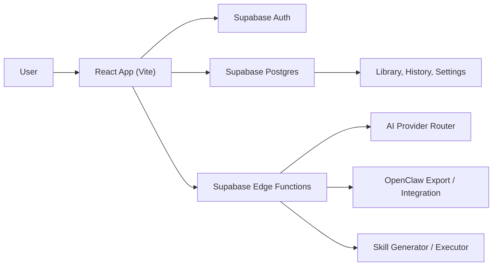
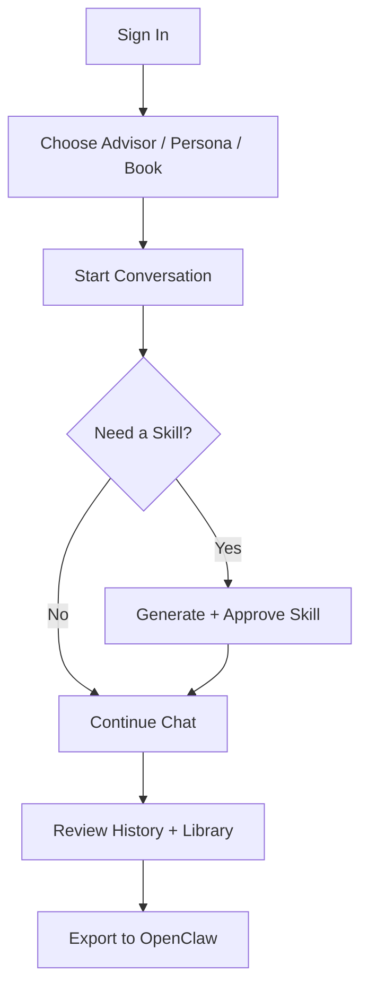

# MindBoard (GENSHAI Cognitive OS)

MindBoard is an AI-assisted thinking workspace for better decisions.  
It gives users a personal board of advisors with distinct mental models, plus chat, skills, and OpenClaw export workflows.

## Quick Navigation

- [What You Can Do](#what-you-can-do)
- [System Visualization](#system-visualization)
- [User Journey](#user-journey)
- [Project Structure](#project-structure)
- [Getting Started](#getting-started)
- [Scripts](#scripts)
- [Supabase Functions](#supabase-functions)

## What You Can Do

- Chat with advisors using configurable style, tone, and complexity
- Use persona chat and book chat experiences
- Browse a mental model library and conversation history
- Generate, review, approve, and execute skills
- Export advisor blueprints for OpenClaw (`SOUL.md`, `AGENTS.md`, `SKILL.md`)
- Manage personas/frameworks/books/providers in admin dashboards

## System Visualization



## User Journey



## Project Structure

- `src/`: React app pages, components, hooks, and shared logic
- `supabase/functions/`: chat, skill, generation, and integration Edge Functions
- `supabase/migrations/`: database schema and RLS migrations
- `docs/plans/`: architecture and implementation plans

<details>
<summary>Expand important app routes</summary>

- `/` landing
- `/advisors` advisor list
- `/chat/:advisorId` advisor chat
- `/persona/:personaId` persona chat
- `/book/:bookId` book chat
- `/library` model library
- `/history` chat history
- `/skills` skills library
- `/openclaw` OpenClaw export dashboard
- `/admin/*` admin dashboards

</details>

## Getting Started

### 1. Install dependencies

```bash
npm install
```

### 2. Configure environment

Create or update `.env`:

```env
VITE_SUPABASE_URL=...
VITE_SUPABASE_PUBLISHABLE_KEY=...
VITE_SUPABASE_PROJECT_ID=...
```

### 3. Start local dev server

```bash
npm run dev
```

Default local URL: `http://localhost:5173`

## Scripts

- `npm run dev` start development server
- `npm run build` production build
- `npm run build:dev` development-mode build
- `npm run preview` preview build
- `npm run lint` run ESLint
- `npm run test` run Vitest once
- `npm run test:watch` run Vitest in watch mode

## Supabase Functions

- `advisor-chat`
- `book-chat`
- `persona-chat`
- `generate-advisor`
- `skill-generator`
- `skill-executor`
- `goodreads-import`
- `fetch-models`
- `export-openclaw`

If you run functions locally, install Supabase CLI and link this project first.
